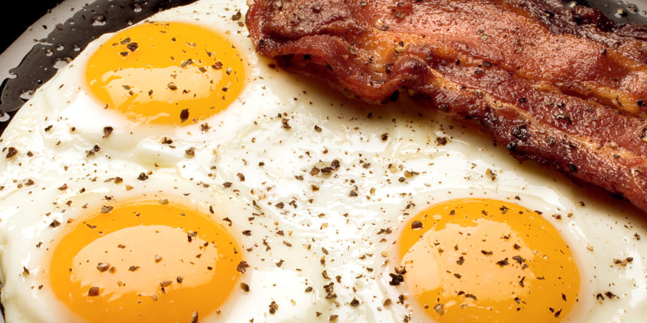

<h1>gebakken eiren</h1>

<<<<<<< HEAD
(perfect-gebakken-ei-916x458.jpg)

<h2>Ingrediënten</h2>
<li>1 ui</li>
<li>li250 gram tomaten</li>
<li>Halve theelepel gedroogde tijm</li>
<li>6 eieren</li>
<li>Scheut olijfolie</li>
<li>Zout en peper</li>
=======
Format: 

Ingrediënten.
1 ui.
250 gram tomaten.
Halve theelepel gedroogde tijm.
6 eieren.
Scheut olijfolie.
Zout en peper.
>>>>>>> 5c60d676b6c3c414c219a413cd99972b6d2ff7ba
